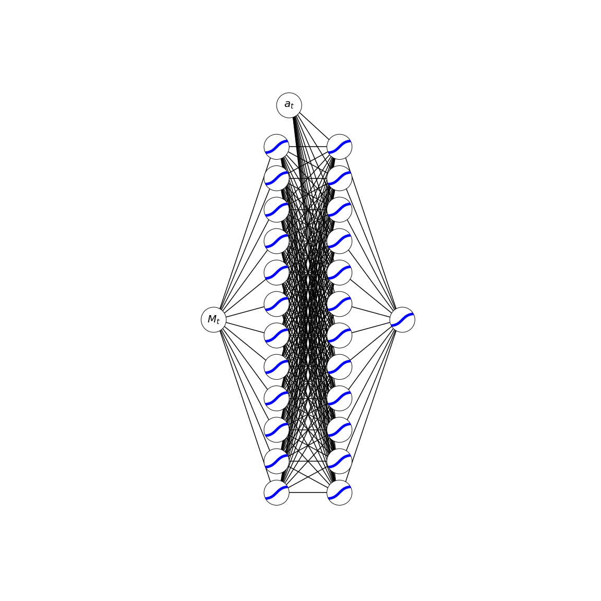
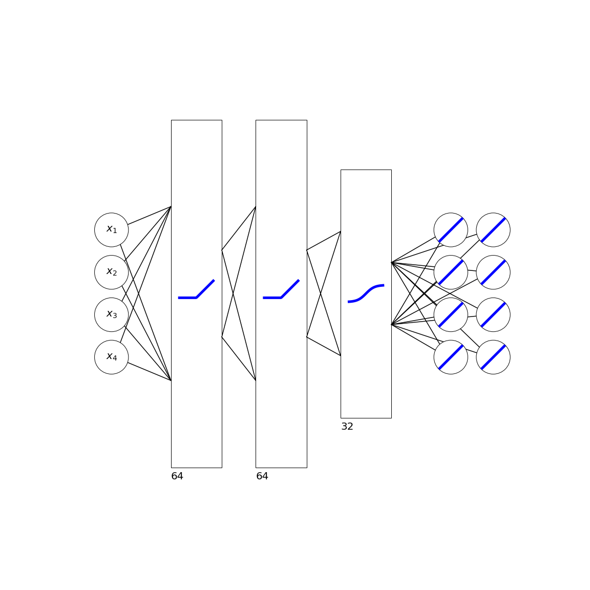

# nnetplot
This is just a small package that facilitates plotting neural networks. It is written for a single use-case so expect rough edges if you try to use it.

## Example 1
```python
import matplotlib.pyplot as plt
from nnetplot import Layer
from nnetplot import vertical_align, horizontal_align
from nnetplot import (connect_nodes_to_rect,
                      connect_nodes_to_nodes,
                      connect_rect_to_nodes,
                      connect_rect_to_rect)

state = Layer(rows=1, columns=1, special = 'input')
h1 = Layer(rows=12, columns=1, activation = 'sigmoid')
action = Layer(rows = 1, columns = 1, special = 'input')
h2 = Layer(rows=12, columns=1, activation = 'sigmoid')
out = Layer(rows = 1, columns = 1, activation='sigmoid')

vertical_align(state, h1, ratio = 0.5)
vertical_align(h1, action, ratio = -0.12)
vertical_align(h1, h2, ratio = 0.5)
vertical_align(h2, out, ratio = 0.5)

horizontal_align(state, h1, spacing = 1)
horizontal_align(h1, action, spacing = 0.2)
horizontal_align(h1, h2, spacing = 1)
horizontal_align(h2, out, spacing = 1)

fig, ax = plt.subplots(figsize = (16,16))
ax.set_aspect('equal')
ax.axis('off')

state.draw_nodes(ax)
state.annotate_nodes(ax, ['$M_t$'], fontsize = 20)
h1.draw_nodes(ax)
action.draw_nodes(ax)
action.annotate_nodes(ax, ['$a_t$'], fontsize = 20)
h2.draw_nodes(ax)
out.draw_nodes(ax)

connect_nodes_to_nodes(layer0=state, layer1=h1, axis=ax)
connect_nodes_to_nodes(layer0=h1, layer1=h2, axis=ax)
connect_nodes_to_nodes(layer0=action, layer1=h2, axis=ax)
connect_nodes_to_nodes(layer0=h2, layer1=out, axis=ax)
```



## Example 2
```python
import matplotlib.pyplot as plt
import numpy as np
from nnetplot import Layer
from nnetplot import vertical_align, horizontal_align
from nnetplot import (connect_nodes_to_rect,
                      connect_nodes_to_nodes,
                      connect_rect_to_nodes,
                      connect_rect_to_rect)

inp = Layer(rows=4, columns=1, special = 'input')
h1 = Layer(rows=np.sqrt(64), columns=1, activation = 'relu') # Scale big layers with sqrt for aesthetics
h2 = Layer(rows=np.sqrt(64), columns=1, activation = 'relu')
h3 = Layer(rows=np.sqrt(32), columns=1, activation = 'sigmoid')
out = Layer(rows = 4, columns = 2, special = False, activation='linear')

vertical_align(inp, h1, ratio = 0.5)
vertical_align(h1, h2, ratio = 0.5)
vertical_align(h2, h3, ratio = 0.5)
vertical_align(h3, out, ratio = 0.5)

horizontal_align(inp, h1, spacing = 1)
horizontal_align(h1, h2, spacing = 1)
horizontal_align(h2, h3, spacing = 1)
horizontal_align(h3, out, spacing = 1)


fig, ax = plt.subplots(figsize = (16,16))
ax.set_aspect('equal')
ax.axis('off')

inp.draw_nodes(ax)
inp.annotate_nodes(ax, ['$x_1$', '$x_2$', '$x_3$', '$x_4$'], fontsize = 20)
h1.draw_rect(ax, pad = 0.1)
h1.annotate_rect(ax, '64', xpad = 0.1, ypad = 0.15, fontsize = 20)
h2.draw_rect(ax, pad = 0.1)
h2.annotate_rect(ax, '64', xpad = 0.1, ypad = 0.15, fontsize = 20)
h3.draw_rect(ax, pad = 0.1)
h3.annotate_rect(ax, '32', xpad = 0.1, ypad = 0.15, fontsize = 20)
out.draw_nodes(ax)

connect_nodes_to_rect(layer0=inp, layer1=h1, axis=ax, 
                      inbound_kw = {'pad': 0.1, 'width': 0.5}
                     )
connect_rect_to_rect(layer0=h1, layer1=h2, axis=ax, 
                     inbound_kw = {'pad': 0.1, 'width': 0.5},
                     outbound_kw = {'pad': 0.1, 'width': 0.25}
                    )
connect_rect_to_rect(layer0=h2, layer1=h3, axis=ax, 
                     inbound_kw = {'pad': 0.1, 'width': 0.5},
                     outbound_kw = {'pad': 0.1, 'width': 0.25}
                    )
connect_rect_to_nodes(layer0=h3, layer1=out, axis=ax, 
                      outbound_kw = {'pad': 0.1, 'width': 0.25}
                     )

```
